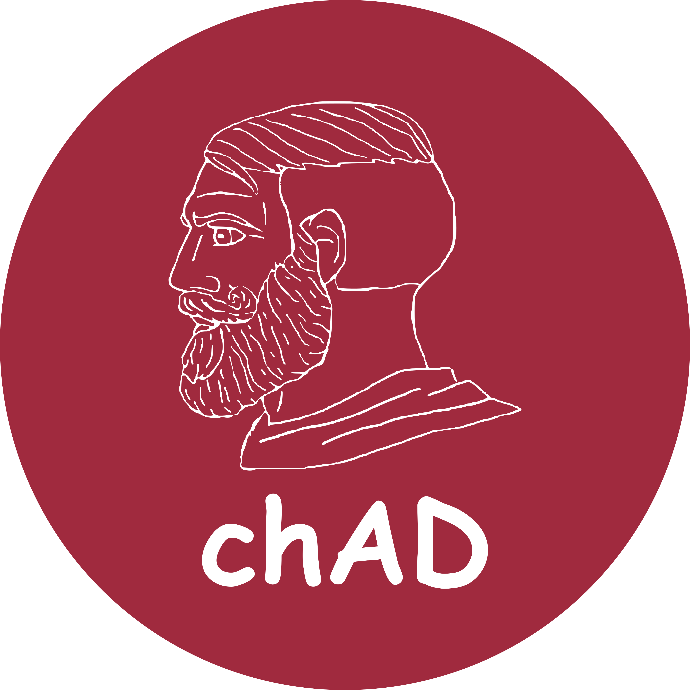

# EngHack2021 project: chAD

# Table of Contents
- [Table of Contents](#table-of-contents)
- [About the Project](#about-the-project)
- [Usage](#usage)
  - [Command Types](#command-types)
- [License](#license)
- [The Team](#the-team)
# About the Project
A way for advertisers to advertise on one of the hottest social media platforms of 2021 and for server owners to
earn some money on the side for hosting ads on their server.
# Usage
Add the bot using the link in our website. 

There are a plenty of commands to choose from. The prefix is `ad`. You can change the prefix to what you want in setting.py
### Command Types
- help
  - Displays help message for the bot

# License
This project is released under the MIT license, see `LICENSE` for more info.
# The Team
Yuvraj Dwivedi - [LinkedIn](https://www.linkedin.com/in/yuvrajdwivedi/), [Website]()

Joonseo Lee - [LinkedIn](https://www.linkedin.com/joonsauce), [Website](https://joonsauce.me)

Farzad Rahman - [LinkedIn](https://www.linkedin.com/in/farzadrahman/), [Website](https://farzadr.me)

Tyseer Toufiq - [LinkedIn](https://www.linkedin.com/in/tyseer-toufiq-a3b8b11aa/), [Website](https://tyseer.tech)
